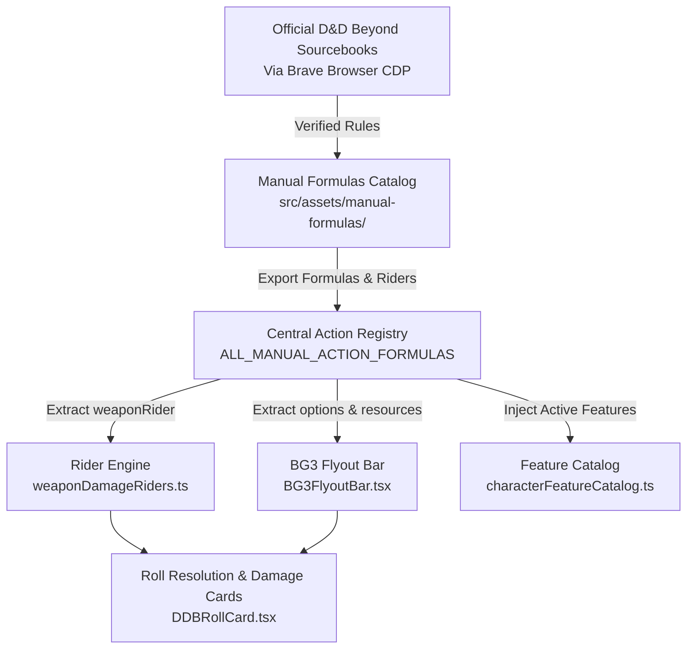

# Embers Data-Driven Architecture & Mechanics Specification

> **Version**: 1.0 (2024/5.5e Compatible)  
> **Source Grounding**: D&D Beyond Live Sourcebooks via Brave Browser CDP (`PHB 2024`, `VSSPP2`, `GHPG`, `EFOTA`)  
> **Location**: `src/assets/manual-formulas/`

---

## 1. Core Philosophy: Pure Data-Driven Architecture

In traditional tabletop implementations, game mechanics and subclass bonuses are often scattered across UI renderers, conditional statements (`if (char.class === "barbarian")`), or static string descriptions in tooltips.

Embers strictly enforces a **Pure Data-Driven Architecture (Single Source of Truth)**:

1. **Zero Hardcoded Logic in UI**: UI components such as `ActionDock`, `BG3FlyoutBar`, `DDBRollCard`, and `CustomDiceRoller` must never contain hardcoded class names, subclass rules, dice formulas, or damage types.
2. **Schema-Driven Engine**: All class features, weapon riders, resources, and interactive options must conform to TypeScript schemas in `src/types/manualFormula.ts`.
3. **Automated Registration**: All formulas registered in `src/assets/manual-formulas/classes/` are automatically ingested by the runtime registries (`ALL_MANUAL_ACTION_FORMULAS`, `weaponDamageRiders.ts`, `effectsTool.ts`), allowing the game engine to calculate, roll, and display mechanics dynamically.



---

## 2. Grounding in Official Sourcebooks via Brave Browser CDP

To guarantee 100% adherence to authentic rules, formulas are grounded directly in official digital sourcebooks on D&D Beyond using authenticated Brave Browser CDP (`ws://127.0.0.1:9222`):

- **Player's Handbook 2024 (PHB 2024)**: Full Level 1–20 core progressions for Barbarian, Bard, Cleric, Druid, Fighter, Monk, Paladin, Ranger, Rogue, Sorcerer, Warlock, Wizard.
- **Valda's Spire of Secrets: Player Pack 2 (VSSPP2)** (`/sources/dnd/vsspp2`):
  - **Gunslinger**: Full Level 1–20 core class with Risk Dice, Quick Draw, Gut Shot, Rapid Reload, and Maverick Capstone.
  - **Heroic Sorcery (Sorcerer)**: Martial Sorcery, Extra Attack (cantrip swap), Mystical Maneuvers (Blinding Attack, Ruinous Blow, Wounding Strike), and Heroic Haste (concentration-free).
  - **Pistolero (Gunslinger)**: Dual-wielding and trick shot mechanics.
  - **College of Masks (Bard)**: Persona Masks (Angel, Demon, Dragon, Faceless, Lord, etc.).
  - **Dragon Domain (Cleric)**: Legendary Aspects (Breath, Scales, Wings, Tyrant).
  - **Circle of the City (Druid)**: Urban adaptation and municipal wild shape features.
  - **Beastborne (Ranger)**: Bestial Aspects (Carnage weapon damage rider, Instinct, Ferocity).
  - **Magic Missile Mage (Wizard)**: Versatile Missiles (damage shifting, force arcs, auto-hit scaling).
- **Grim Hollow: Player's Guide (GHPG)** (`/sources/dnd/ghpg`):
  - **Monster Hunter**: Full Level 1–20 progression with Monster Grimoire, Weapon Mastery, Studied Response, Expert Strike (Int-to-damage weapon rider), Extra Attack, Lair Sense, Slayer's Aid, and Grave Strike Capstone.
- **Eberron: Forge of the Artificer (EFOTA)** (`/sources/dnd/efota`):
  - **Artificer**: Full Level 1–20 core progression with Magical Tinkering, Infuse Item, Tool Expertise, Flash of Genius, Magic Item Adept/Savant/Master, and Soul of Artifice Capstone.
  - Subclasses: **Armorer** (Guardian/Infiltrator with Lightning Launcher rider), **Battle Smith** (Arcane Jolt force rider), **Alchemist**, **Artillerist**, **Cartomancer**.

---

## 3. Weapon Damage Riders (`weaponRider`) & Multi-Attack Flow

### 3.1 Separate "To Hit" Rolls for Multi-Attack
Prior to resolving damage, martial classes often make multiple discrete attacks (e.g., Monk's Flurry of Blows, Fighter's Extra Attack, Gunslinger's Rapid Reload volleys). 

To support this cleanly:
- The **"To Hit" button** is maintained directly on each weapon row in `BG3FlyoutBar.tsx`.
- Players can roll single d20 attack checks for each individual strike.
- Once a hit is confirmed, the player clicks **"Damage"**, which gathers base weapon damage plus all active, qualified `weaponRider` operations.

### 3.2 Schema Definition
```typescript
export interface WeaponDamageRiderOperation {
  type: "weapon_damage_rider"; // Discriminator for TypeScript schema
  id: string;
  name?: string;
  classId: string;
  subclassId?: string;
  minLevel?: number;
  requiresBuff?: string;                // e.g., "rage"
  requiresWeaponProperties?: string[]; // e.g., ["finesse", "ranged"]
  flat?: {
    byClassLevel: Array<{ minLevel: number; value: number }>;
  };
  dice?: string;                        // e.g., "1d6", "2d8"
  diceByClassLevel?: Array<{ minLevel: number; dice: string }>;
  bonus?: "halfClassLevel";             // e.g., Divine Fury (+ floor(level/2))
  damageType?: string;                  // e.g., "radiant", "force", "lightning"
  damageTypeChoices?: string[];         // e.g., ["radiant", "necrotic"]
  defaultChoice?: string;
  frequency?: "every_hit" | "first_hit_per_turn";
}
```

### 3.3 Frequency Rules
- **`first_hit_per_turn`**: Applied only once per turn on the first confirmed hit (e.g., Rogue *Sneak Attack*, Barbarian Zealot *Divine Fury*, Artificer Armorer *Lightning Launcher*, Artificer Battle Smith *Arcane Jolt*, Sorcerer *Mystical Maneuvers*).
- **`every_hit`**: Applied to every successful weapon hit while active (e.g., Barbarian *Rage Damage*, Ranger Beastborne *Carnage*, Monster Hunter *Expert Strike*).

---

## 4. Interactive Flyout Options (`options`) & Resource Pools

Features with choices render nested modal/flyout buttons directly on the BG3-style action dock without custom JSX per class.

### 4.1 Schema
```typescript
export interface FeatureActionOption {
  id: string;
  name: string;
  cost?: number;
  desc?: string;
  description?: string;
  actionType?: "action" | "bonus" | "reaction" | "none" | "special";
  weaponDamageRider?: {
    damageFormula: string;
    damageType: string;
    condition?: string;
  };
  weaponRider?: WeaponDamageRiderOperation;
}
```

### 4.2 Resource Scaling Schema
```typescript
export interface ActionResourceConfig {
  name: string;
  maxPerClassLevel?: number;
  canExceedMax?: boolean;
  resetType?: string; // "Short Rest", "Long Rest", "Combat Momentum"
  scaling?: {
    type: "class_level" | "half_class_level" | "level_table" | "flat";
    classId?: string;
    multiplier?: number;
    table?: Array<{ minLevel: number; value: number }>;
  };
}
```

---

## 5. Verification & Testing

Every class, subclass, weapon rider, and option set must be validated through automated Vitest suites:
- `allSourcebooksClasses.test.ts`: Verifies complete Level 1–20 progression and mechanics for all non-PHB classes (Artificer, Gunslinger, Monster Hunter) and VSSPP2 subclasses.
- `phb2024ClassesAndMechanics.test.ts`: Validates all 12 PHB 2024 classes.
- `weaponDamageRiders.test.ts`: Verifies dynamic rider resolution, scaling tables, and conditions.
- `npm run build`: Validates TypeScript typing and production bundle assembly.
